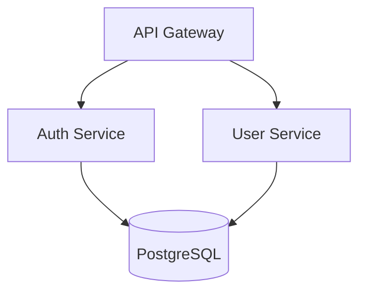

# Arquiteto Sênior

Ferramentas de design e análise de arquitetura para tomada de decisões técnicas bem embasadas.

## Sumário

- [Início Rápido](#início-rápido)
- [Visão Geral das Ferramentas](#visão-geral-das-ferramentas)
  - [Gerador de Diagrama de Arquitetura](#1-gerador-de-diagrama-de-arquitetura)
  - [Analisador de Dependências](#2-analisador-de-dependências)
  - [Arquiteto de Projeto](#3-arquiteto-de-projeto)
- [Fluxos de Decisão](#fluxos-de-decisão)
  - [Seleção de Banco de Dados](#fluxo-de-seleção-de-banco-de-dados)
  - [Seleção de Padrão Arquitetural](#fluxo-de-seleção-de-padrão-arquitetural)
  - [Monólito vs Microsserviços](#decisão-monólito-vs-microsserviços)
- [Documentação de Referência](#documentação-de-referência)
- [Cobertura de Stack](#cobertura-de-stack)
- [Comandos Comuns](#comandos-comuns)

---

## Início Rápido

```bash
# Gerar diagrama de arquitetura a partir do projeto
python scripts/architecture_diagram_generator.py ./my-project --format mermaid

# Analisar dependências para problemas
python scripts/dependency_analyzer.py ./my-project --output json

# Obter avaliação de arquitetura
python scripts/project_architect.py ./my-project --verbose
```

---

## Visão Geral das Ferramentas

### 1. Gerador de Diagrama de Arquitetura

Gera diagramas de arquitetura a partir da estrutura do projeto em múltiplos formatos.

**Resolve:** "Preciso visualizar a arquitetura do sistema para documentação ou discussão em equipe"

**Entrada:** Caminho do diretório do projeto
**Saída:** Código do diagrama (Mermaid, PlantUML ou ASCII)

**Tipos de diagrama suportados:**
- `component` - Mostra os módulos e seus relacionamentos
- `layer` - Mostra as camadas arquiteturais (apresentação, negócio, dados)
- `deployment` - Mostra a topologia de implantação

**Uso:**
```bash
# Formato Mermaid (padrão)
python scripts/architecture_diagram_generator.py ./project --format mermaid --type component

# Formato PlantUML
python scripts/architecture_diagram_generator.py ./project --format plantuml --type layer

# Formato ASCII (amigável ao terminal)
python scripts/architecture_diagram_generator.py ./project --format ascii

# Salvar em arquivo
python scripts/architecture_diagram_generator.py ./project -o architecture.md
```

**Exemplo de saída (Mermaid):**


---

### 2. Analisador de Dependências

Analisa dependências do projeto para acoplamento, dependências circulares e pacotes desatualizados.

**Resolve:** "Preciso entender minha árvore de dependências e identificar possíveis problemas"

**Entrada:** Caminho do diretório do projeto
**Saída:** Relatório de análise (JSON ou legível por humanos)

**Analisa:**
- Árvore de dependências (diretas e transitivas)
- Dependências circulares entre módulos
- Pontuação de acoplamento (0-100)
- Pacotes desatualizados

**Gerenciadores de pacotes suportados:**
- npm/yarn (`package.json`)
- Python (`requirements.txt`, `pyproject.toml`)
- Go (`go.mod`)
- Rust (`Cargo.toml`)

**Uso:**
```bash
# Relatório legível por humanos
python scripts/dependency_analyzer.py ./project

# Saída JSON para integração CI/CD
python scripts/dependency_analyzer.py ./project --output json

# Verificar apenas dependências circulares
python scripts/dependency_analyzer.py ./project --check circular

# Modo verboso com recomendações
python scripts/dependency_analyzer.py ./project --verbose
```

**Exemplo de saída:**
```
Relatório de Análise de Dependências
=====================================
Total de dependências: 47 (32 diretas, 15 transitivas)
Pontuação de acoplamento: 72/100 (moderado)

Problemas encontrados:
- CIRCULAR: auth → user → permissions → auth
- DESATUALIZADO: lodash 4.17.15 → 4.17.21 (segurança)

Recomendações:
1. Extrair interface compartilhada para quebrar dependência circular
2. Atualizar lodash para corrigir CVE-2020-8203
```

---

### 3. Arquiteto de Projeto

Analisa a estrutura do projeto e detecta padrões arquiteturais, code smells e oportunidades de melhoria.

**Resolve:** "Quero entender a arquitetura atual e identificar oportunidades de melhoria"

**Entrada:** Caminho do diretório do projeto
**Saída:** Relatório de avaliação de arquitetura

**Detecta:**
- Padrões arquiteturais (MVC, camadas, hexagonal, indicadores de microsserviços)
- Problemas de organização de código (god classes, concerns misturados)
- Violações de camada
- Componentes arquiteturais ausentes

**Uso:**
```bash
# Avaliação completa
python scripts/project_architect.py ./project

# Verboso com recomendações detalhadas
python scripts/project_architect.py ./project --verbose

# Saída JSON
python scripts/project_architect.py ./project --output json

# Verificar aspecto específico
python scripts/project_architect.py ./project --check layers
```

**Exemplo de saída:**
```
Avaliação de Arquitetura
========================
Padrão detectado: Arquitetura em Camadas (confiança: 85%)

Análise da estrutura:
  ✓ controllers/  - Camada de apresentação detectada
  ✓ services/     - Camada de lógica de negócio detectada
  ✓ repositories/ - Camada de acesso a dados detectada
  ⚠ models/       - Modelos de domínio e DTOs misturados

Problemas:
- ARQUIVO GRANDE: UserService.ts (1.847 linhas) - considere dividir
- CONCERNS MISTURADOS: PaymentController contém lógica de negócio

Recomendações:
1. Dividir UserService em serviços focados
2. Mover lógica de negócio dos controllers para services
3. Separar modelos de domínio dos DTOs
```

---

## Fluxos de Decisão

### Fluxo de Seleção de Banco de Dados

Use quando escolher um banco de dados para um novo projeto ou migrar dados existentes.

**Passo 1: Identificar características dos dados**
| Característica | Aponta para SQL | Aponta para NoSQL |
|----------------|---------------|-----------------|
| Estruturado com relacionamentos | ✓ | |
| Transações ACID necessárias | ✓ | |
| Schema flexível/evolutivo | | ✓ |
| Dados orientados a documentos | | ✓ |
| Dados de séries temporais | | ✓ (especializado) |

**Passo 2: Avaliar requisitos de escala**
- <1M registros, região única → PostgreSQL ou MySQL
- 1M-100M registros, leitura intensa → PostgreSQL com read replicas
- >100M registros, distribuição global → CockroachDB, Spanner ou DynamoDB
- Alto throughput de escrita (>10K/s) → Cassandra ou ScyllaDB

**Passo 3: Verificar requisitos de consistência**
- Consistência forte necessária → SQL ou CockroachDB
- Consistência eventual aceitável → DynamoDB, Cassandra, MongoDB

**Passo 4: Documentar a decisão**
Criar um ADR (Registro de Decisão Arquitetural) com:
- Contexto e requisitos
- Opções consideradas
- Decisão e justificativa
- Trade-offs aceitos

**Referência rápida:**
```
PostgreSQL → Escolha padrão para a maioria das aplicações
MongoDB    → Armazenamento de documentos, schema flexível
Redis      → Cache, sessões, funcionalidades em tempo real
DynamoDB   → Serverless, auto-scaling, nativo AWS
TimescaleDB → Dados de séries temporais com interface SQL
```

---

### Fluxo de Seleção de Padrão Arquitetural

Use quando projetar um novo sistema ou refatorar uma arquitetura existente.

**Passo 1: Avaliar o tamanho do time e do projeto**
| Tamanho do Time | Ponto de Partida Recomendado |
|-----------|---------------------------|
| 1-3 desenvolvedores | Monólito modular |
| 4-10 desenvolvedores | Monólito modular ou orientado a serviços |
| 10+ desenvolvedores | Considerar microsserviços |

**Passo 2: Avaliar requisitos de implantação**
- Unidade de implantação única aceitável → Monólito
- Escalonamento independente necessário → Microsserviços
- Misto (alguns serviços escalam diferente) → Híbrido

**Passo 3: Considerar limites de dados**
- Banco de dados compartilhado aceitável → Monólito ou monólito modular
- Isolamento estrito de dados necessário → Microsserviços com BDs separados
- Comunicação orientada a eventos → Event-sourcing/CQRS

**Passo 4: Corresponder o padrão aos requisitos**

| Requisito | Padrão Recomendado |
|-------------|-------------------|
| Desenvolvimento rápido de MVP | Monólito Modular |
| Implantação independente por time | Microsserviços |
| Lógica de domínio complexa | Domain-Driven Design |
| Grande diferença na proporção leitura/escrita | CQRS |
| Trilha de auditoria necessária | Event Sourcing |
| Integrações com terceiros | Hexagonal/Ports & Adapters |

Veja `references/architecture_patterns.md` para descrições detalhadas dos padrões.

---

### Decisão Monólito vs Microsserviços

**Escolha Monólito quando:**
- [ ] Time é pequeno (<10 desenvolvedores)
- [ ] Limites de domínio não estão claros
- [ ] Iteração rápida é prioridade
- [ ] Complexidade operacional deve ser minimizada
- [ ] Banco de dados compartilhado é aceitável

**Escolha Microsserviços quando:**
- [ ] Times podem possuir serviços de ponta a ponta
- [ ] Implantação independente é crítica
- [ ] Requisitos de escala diferentes por componente
- [ ] Diversidade tecnológica é necessária
- [ ] Limites de domínio são bem compreendidos

**Abordagem híbrida:**
Comece com um monólito modular. Extraia serviços apenas quando:
1. Um módulo tem necessidades de escala significativamente diferentes
2. Um time precisa de implantação independente
3. Restrições tecnológicas exigem separação

---

## Documentação de Referência

Carregue estes arquivos para informações detalhadas:

| Arquivo | Contém | Carregar quando o usuário perguntar sobre |
|------|----------|--------------------------|
| `references/architecture_patterns.md` | 9 padrões de arquitetura com trade-offs, exemplos de código e quando usar | "qual padrão?", "microsserviços vs monólito", "orientado a eventos", "CQRS" |
| `references/system_design_workflows.md` | 6 fluxos de trabalho passo a passo para tarefas de design de sistema | "como projetar?", "planejamento de capacidade", "design de API", "migração" |
| `references/tech_decision_guide.md` | Matrizes de decisão para escolhas tecnológicas | "qual banco de dados?", "qual framework?", "qual nuvem?", "qual cache?" |

---

## Cobertura de Stack

**Linguagens:** TypeScript, JavaScript, Python, Go, Swift, Kotlin, Rust
**Frontend:** React, Next.js, Vue, Angular, React Native, Flutter
**Backend:** Node.js, Express, FastAPI, Go, GraphQL, REST
**Bancos de Dados:** PostgreSQL, MySQL, MongoDB, Redis, DynamoDB, Cassandra
**Infraestrutura:** Docker, Kubernetes, Terraform, AWS, GCP, Azure
**CI/CD:** GitHub Actions, GitLab CI, CircleCI, Jenkins

---

## Comandos Comuns

```bash
# Visualização de arquitetura
python scripts/architecture_diagram_generator.py . --format mermaid
python scripts/architecture_diagram_generator.py . --format plantuml
python scripts/architecture_diagram_generator.py . --format ascii

# Análise de dependências
python scripts/dependency_analyzer.py . --verbose
python scripts/dependency_analyzer.py . --check circular
python scripts/dependency_analyzer.py . --output json

# Avaliação de arquitetura
python scripts/project_architect.py . --verbose
python scripts/project_architect.py . --check layers
python scripts/project_architect.py . --output json
```

---

## Obtendo Ajuda

1. Execute qualquer script com `--help` para informações de uso
2. Consulte a documentação de referência para padrões e fluxos detalhados
3. Use o flag `--verbose` para explicações e recomendações detalhadas
