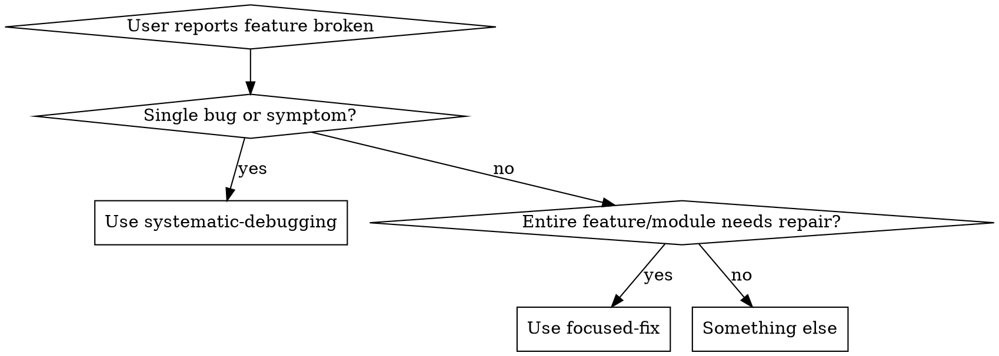
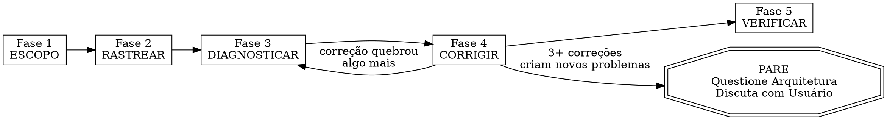

# Focused Fix — Reparo Profundo de Funcionalidade

## Quando Usar

Ative quando o usuário pedir para corrigir, depurar ou fazer uma funcionalidade/módulo/área específica funcionar. Gatilhos principais:
- "faça X funcionar"
- "corrija a funcionalidade Y"
- "o módulo Z está quebrado"
- "foque em [área]"
- "esta funcionalidade precisa funcionar corretamente"

Isso NÃO é para correções rápidas de bug único (use systematic-debugging para isso). Isso é para quando uma funcionalidade ou módulo inteiro precisa de reparo sistemático — rastreando cada dependência, lendo logs, verificando testes, mapeando o grafo completo de dependências.



## A Lei de Ferro

```
SEM CORREÇÕES SEM COMPLETAR ESCOPO → RASTREAR → DIAGNOSTICAR PRIMEIRO
```

Se você não terminou a Fase 3, não pode propor correções. Ponto final.

**Violar a letra dessas fases é violar o espírito do reparo focado.**

## Protocolo — Siga ESTRITAMENTE estas 5 fases EM ORDEM



### Fase 1: ESCOPO — Mapear o Limite da Funcionalidade

Antes de tocar em qualquer código, entenda o escopo completo da funcionalidade.

1. Pergunte ao usuário: "Em qual funcionalidade/pasta devo focar?" se ainda não estiver claro
2. Identifique a pasta/arquivos PRIMÁRIOS para esta funcionalidade
3. Mapeie TODOS os arquivos nessa pasta — leia cada um, entenda seu propósito
4. Crie um manifesto de funcionalidade:

```
ESCOPO DA FUNCIONALIDADE:
  Caminho primário: src/features/auth/
  Pontos de entrada: [arquivos importados por outras partes do app]
  Arquivos internos: [arquivos usados apenas dentro desta funcionalidade]
  Total de arquivos: N
  Total de linhas: N
```

### Fase 2: RASTREAR — Mapear Todas as Dependências (Dentro E Fora)

Rastreie cada conexão que esta funcionalidade tem com o resto da base de código.

**ENTRADA (o que esta funcionalidade importa):**
1. Para cada declaração de importação em cada arquivo na pasta da funcionalidade:
   - Rastreie até a fonte
   - Verifique se o arquivo fonte existe
   - Verifique se a entidade importada (função, tipo, componente) existe e é exportada
   - Verifique se os tipos/assinaturas correspondem ao que a funcionalidade espera
2. Verifique se há:
   - Variáveis de ambiente usadas (busque por process.env, import.meta.env, os.environ, etc.)
   - Arquivos de configuração referenciados
   - Modelos/schemas de banco de dados usados
   - Endpoints de API chamados
   - Pacotes de terceiros importados

**SAÍDA (o que importa esta funcionalidade):**
1. Pesquise toda a base de código por importações desta pasta de funcionalidade
2. Para cada consumidor:
   - Verifique se estão importando entidades que realmente existem
   - Verifique se estão usando a API/interface correta
   - Note se algum consumidor está usando padrões depreciados

Formato de saída:
```
MAPA DE DEPENDÊNCIAS:
  Entrada (esta funcionalidade depende de):
    src/lib/db.ts → usado em auth/repository.ts (getUserById, createUser)
    src/lib/jwt.ts → usado em auth/service.ts (signToken, verifyToken)
    @prisma/client → usado em auth/repository.ts
    process.env.JWT_SECRET → usado em auth/service.ts
    process.env.DATABASE_URL → usado via prisma

  Saída (depende desta funcionalidade):
    src/app/api/login/route.ts → importa { login } de auth/service
    src/app/api/register/route.ts → importa { register } de auth/service
    src/middleware.ts → importa { verifyToken } de auth/service

  Variáveis de env necessárias: JWT_SECRET, DATABASE_URL
  Arquivos de configuração: prisma/schema.prisma (modelo User)
```

### Fase 3: DIAGNOSTICAR — Encontrar Todos os Problemas

Verifique sistematicamente se há problemas. Execute TODAS estas verificações:

**QUALIDADE DO CÓDIGO:**
- [ ] Cada importação resolve para um arquivo/exportação real
- [ ] Sem dependências circulares dentro da funcionalidade
- [ ] Tipos são consistentes entre limites (sem `any` em interfaces)
- [ ] Tratamento de erro existe para todas as operações async
- [ ] Sem comentários TODO/FIXME/HACK indicando problemas conhecidos

**RUNTIME:**
- [ ] Todas as variáveis de ambiente necessárias estão definidas (verifique .env)
- [ ] Migrações de banco de dados estão atualizadas (se aplicável)
- [ ] Endpoints de API retornam formas esperadas
- [ ] Sem valores hardcoded que deveriam ser configuráveis

**TESTES:**
- [ ] Execute TODOS os testes relacionados a esta funcionalidade: encontre-os buscando por importações da pasta da funcionalidade
- [ ] Registre cada falha com saída de erro completa
- [ ] Verifique cobertura de testes — há caminhos de código não testados?

**LOGS E ERROS:**
- [ ] Pesquise por quaisquer arquivos de log, relatórios de erro ou rastreamento de erro estilo Sentry
- [ ] Verifique o log do git para mudanças recentes nesta funcionalidade: `git log --oneline -20 -- <feature-path>`
- [ ] Verifique se commits recentes podem ter quebrado algo: `git log --oneline -5 --all -- <arquivos dos quais esta funcionalidade depende>`

**CONFIGURAÇÃO:**
- [ ] Verifique se todos os arquivos de configuração dos quais esta funcionalidade depende são válidos
- [ ] Verifique se há incompatibilidades entre configs de desenvolvimento e produção
- [ ] Verifique se credenciais de serviços de terceiros são válidas (se testável)

**CONFIRMAÇÃO DE CAUSA RAIZ:**
Para cada problema CRÍTICO encontrado, confirme a causa raiz antes de adicioná-lo à lista de correção:
- Declare claramente: "Acho que X é a causa raiz porque Y"
- Rastreie o fluxo de dados/controle para trás para verificar — não confie em sintomas superficiais
- Se o problema abranger múltiplos componentes, adicione logging de diagnóstico em cada limite para identificar qual camada falha
- **SUB-SKILL OBRIGATÓRIA:** Para bugs complexos encontrados durante o diagnóstico, aplique a Fase 1 de `superpowers:systematic-debugging` (Investigação de Causa Raiz) para confirmar antes de prosseguir

**ROTULAGEM DE RISCO:**
Atribua a cada problema um rótulo de risco:

| Risco | Critérios |
|---|---|
| ALTO | Superfície de API pública / contrato de interface quebrável / schema de BD / lógica de auth ou segurança / módulo amplamente importado (>3 chamadores) / hotspot do git |
| MÉDIO | Módulo interno com testes / utilitário compartilhado / config com impacto de runtime / chamadores internos de funções alteradas |
| BAIXO | Módulo folha / arquivo isolado / mudança somente de teste / helper de propósito único sem chamadores |

Formato de saída:
```
RELATÓRIO DE DIAGNÓSTICO:
  Problemas encontrados: N

  CRÍTICOS:
    1. [ALTO] [arquivo:linha] — descrição do problema. Causa raiz: [explicação confirmada]
    2. [ALTO] [arquivo:linha] — descrição do problema. Causa raiz: [explicação confirmada]

  AVISOS:
    1. [MÉDIO] [arquivo:linha] — descrição do problema
    2. [BAIXO] [arquivo:linha] — descrição do problema

  TESTES:
    Executados: N testes
    Aprovados: N
    Falhos: N
    [liste cada falha com resumo de uma linha]
```

### Fase 4: CORRIGIR — Reparar Tudo Sistematicamente

Corrija os problemas nesta EXATA ordem:

1. **DEPENDÊNCIAS PRIMEIRO** — corrija importações quebradas, pacotes ausentes, versões erradas
2. **TIPOS SEGUNDO** — corrija incompatibilidades de tipo nos limites da funcionalidade
3. **LÓGICA TERCEIRO** — corrija bugs de lógica de negócio reais
4. **TESTES QUARTO** — corrija ou crie testes para cada correção
5. **INTEGRAÇÃO POR ÚLTIMO** — verifique se a funcionalidade funciona de ponta a ponta com seus consumidores

Regras:
- Corrija UM problema por vez
- Após cada correção, execute o teste relacionado para confirmar que funciona
- Se uma correção quebrar outra coisa, PARE e reavalie (volte para DIAGNOSTICAR)
- Mantenha um log em execução de cada mudança feita
- Nunca mude código fora da pasta da funcionalidade sem declarar explicitamente o porquê
- Corrija problemas de risco ALTO antes de MÉDIO, MÉDIO antes de BAIXO

**REGRA DE ESCALADA — Verificação de Arquitetura em 3 Tentativas:**
Se 3+ correções nesta fase criarem NOVOS problemas (não pré-existentes), PARE imediatamente.

Este padrão indica um problema arquitetural, não uma coleção de bugs:
- Cada correção revela novo estado compartilhado / acoplamento / problema em um lugar diferente
- Correções requerem "grande refatoração" para implementar
- Cada correção cria novos sintomas em outro lugar

**Ação:** Pare de corrigir. Diga ao usuário: "3+ correções cascatearam em novos problemas. Isso sugere que a arquitetura da funcionalidade pode precisar ser repensada, não corrigida. Aqui está o que encontrei: [resumo]. Devemos continuar corrigindo sintomas ou discutir a reestruturação?"

NÃO tente a correção nº 4 sem esta discussão.

Formato de saída após cada correção:
```
CORREÇÃO #1:
  Arquivo: auth/service.ts:45
  Problema: signToken chamado com ordem de argumento errada
  Mudança: trocou (expiresIn, payload) para (payload, expiresIn)
  Teste: auth.test.ts → APROVADO
```

### Fase 5: VERIFICAR — Confirmar que Tudo Funciona

Após todas as correções serem aplicadas:

1. Execute TODOS os testes na pasta da funcionalidade — cada um deve passar
2. Execute TODOS os testes em arquivos que IMPORTAM desta funcionalidade — devem passar
3. Execute o conjunto completo de testes se disponível — verifique regressões
4. Se a funcionalidade tem UI, descreva como verificá-la manualmente
5. Resuma todas as mudanças feitas

Saída final:
```
FOCUSED FIX CONCLUÍDO:
  Funcionalidade: auth
  Arquivos alterados: 4
  Total de correções: 7
  Testes: 23/23 aprovados
  Regressões: 0

  Mudanças:
    1. auth/service.ts — corrigida ordem de argumento de assinatura de token
    2. auth/repository.ts — adicionada verificação de nulo para busca de usuário
    3. auth/middleware.ts — corrigido tratamento de erro async
    4. auth/types.ts — tipo UserResponse alinhado com schema real de BD

  Consumidores verificados:
    - src/app/api/login/route.ts ✅
    - src/app/api/register/route.ts ✅
    - src/middleware.ts ✅
```

## Sinais de Alerta — PARE e Retorne à Fase Atual

Se você se pegar pensando em qualquer um destes, está pulando fases:

- "Posso ver o bug, deixe-me apenas corrigi-lo" → PARE. Você não rastreou dependências ainda.
- "Determinar o escopo é exagero, é obviamente apenas este arquivo" → PARE. Isso está sempre errado para correções em nível de funcionalidade.
- "Vou mapear dependências após corrigir as coisas óbvias" → PARE. Você perderá causas raiz.
- "O usuário disse para corrigir X, então só preciso olhar para X" → PARE. Funcionalidades têm dependências.
- "Os testes estão passando, então terminei" → PARE. Você executou os testes dos consumidores também?
- "Não preciso verificar variáveis de env para isso" → PARE. Problemas de configuração se disfarçam de bugs de código.
- "Mais uma correção deve resolver" (após 2+ falhas em cascata) → PARE. Escale.
- "Vou pular o relatório de diagnóstico, as correções são óbvias" → PARE. Escreva.

**TODOS esses significam: Retorne à fase em que deveria estar.**

## Racionalizações Comuns

| Desculpa | Realidade |
|---|---|
| "A funcionalidade é pequena, não preciso de todas as 5 fases" | Funcionalidades pequenas também têm dependências. As Fases 1-2 levam minutos para funcionalidades pequenas — faça-as. |
| "Já conheço esta base de código" | O conhecimento decai. Rastreie as importações reais, não confie na memória. |
| "O usuário quer velocidade, não processo" | Pular fases causa retrabalho. Sistemático é mais rápido que se debater. |
| "Apenas um arquivo está quebrado" | Se apenas um arquivo estivesse quebrado, o usuário diria "corrija este bug", não "faça a funcionalidade funcionar." |
| "Corrigi os testes, então funciona" | Os testes podem passar enquanto os consumidores estão quebrados. Verifique a Fase 5 completamente. |
| "O mapa de dependências é grande demais para rastrear" | Então a funcionalidade é grande demais para corrigir sem rastrear. É exatamente por isso que você precisa disso. |
| "A causa raiz é óbvia, não preciso confirmar" | Causas raiz "óbvias" estão erradas 40% do tempo. Confirme com evidência. |
| "3 falhas em cascata são normais para uma grande correção" | 3 falhas em cascata significa que você está corrigindo sintomas de um problema arquitetural. |

## Anti-Padrões — NUNCA faça isso

| Anti-Padrão | Por Que Está Errado |
|---|---|
| Começar a corrigir código antes de mapear todas as dependências | Você perderá causas raiz e criará correções do tipo bater e correr |
| Corrigir apenas o arquivo que o usuário mencionou | Arquivos relacionados provavelmente também têm problemas |
| Ignorar variáveis de ambiente e configuração | Muitos "bugs de código" são na verdade problemas de configuração |
| Pular a fase de execução de testes | Você não pode verificar correções sem executar testes |
| Fazer mudanças fora da pasta da funcionalidade sem explicar o porquê | Efeitos colaterais inesperados confundem o usuário |
| Corrigir sintomas em arquivos consumidores em vez de causa raiz na funcionalidade | Curativos que quebram quando o próximo consumidor aparece |
| Declarar "feito" sem executar testes de verificação | Correções não testadas são correções não verificadas |
| Mudar a API pública sem atualizar todos os consumidores | Quebra tudo que depende da funcionalidade |

## Skills Relacionadas

- **`superpowers:systematic-debugging`** — Use dentro da Fase 3 para rastreamento de causa raiz de bugs individuais complexos
- **`superpowers:verification-before-completion`** — Use dentro da Fase 5 antes de afirmar que a funcionalidade está corrigida
- **`scope`** — Se você precisar entender o raio de blast antes de começar, execute scope primeiro e depois focused-fix

## Referência Rápida

| Fase | Ação Principal | Saída |
|---|---|---|
| ESCOPO | Leia cada arquivo, mapeie pontos de entrada | Manifesto de funcionalidade |
| RASTREAR | Mapeie dependências de entrada + saída | Mapa de dependências |
| DIAGNOSTICAR | Verifique código, runtime, testes, logs, config | Relatório de diagnóstico |
| CORRIGIR | Corrija em ordem: deps → tipos → lógica → testes → integração | Log de correção por problema |
| VERIFICAR | Execute todos os testes, verifique consumidores, resuma | Relatório de conclusão |
