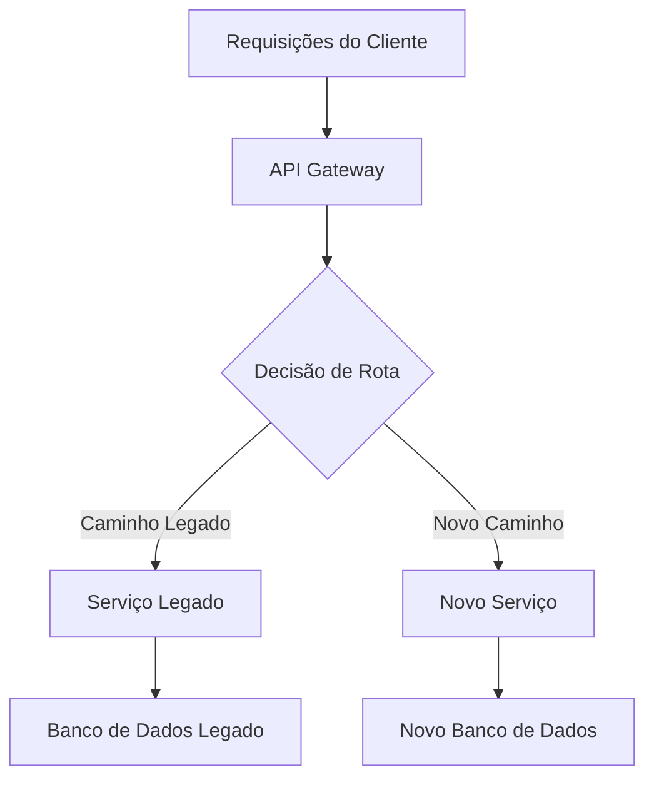

# Migration Architect

**Nível:** PODEROSO
**Categoria:** Engenharia - Estratégia de Migração
**Propósito:** Planejamento de migração com zero downtime, validação de compatibilidade e geração de estratégia de rollback

## Visão Geral

A skill Migration Architect fornece ferramentas e metodologias abrangentes para planejar, executar e validar migrações complexas de sistemas com impacto mínimo nos negócios. Esta skill combina padrões de migração comprovados com ferramentas de planejamento automatizado para garantir transições bem-sucedidas entre sistemas, bancos de dados e infraestrutura.

## Capacidades Principais

### 1. Planejamento de Estratégia de Migração
- **Planejamento de Migração em Fases:** Divida migrações complexas em fases gerenciáveis com portões de validação claros
- **Avaliação de Riscos:** Identifique pontos potenciais de falha e estratégias de mitigação antes da execução
- **Estimativa de Cronograma:** Gere cronogramas realistas com base na complexidade da migração e restrições de recursos
- **Comunicação com Stakeholders:** Crie templates de comunicação e painéis de progresso

### 2. Análise de Compatibilidade
- **Evolução de Esquema:** Analise mudanças de esquema de banco de dados para questões de compatibilidade retroativa
- **Versionamento de API:** Detecte mudanças disruptivas em APIs REST/GraphQL e interfaces de microsserviços
- **Validação de Tipos de Dados:** Identifique incompatibilidades de formato de dados e requisitos de conversão
- **Análise de Restrições:** Valide integridade referencial e mudanças nas regras de negócio

### 3. Geração de Estratégia de Rollback
- **Planos de Rollback Automatizados:** Gere procedimentos abrangentes de rollback para cada fase da migração
- **Scripts de Recuperação de Dados:** Crie procedimentos de restauração de dados point-in-time
- **Rollback de Serviço:** Planeje rollbacks de versão de serviço com gerenciamento de tráfego
- **Pontos de Verificação de Validação:** Defina critérios de sucesso e gatilhos de rollback

## Padrões de Migração

### Migrações de Banco de Dados

#### Padrões de Evolução de Esquema
1. **Padrão Expand-Contract**
   - **Expandir:** Adicione novas colunas/tabelas ao lado do esquema existente
   - **Escrita Dupla:** A aplicação escreve no esquema antigo e no novo
   - **Migração:** Preencha dados históricos no novo esquema
   - **Contrair:** Remova colunas/tabelas antigas após validação

2. **Padrão de Esquema Paralelo**
   - Execute o novo esquema em paralelo com o existente
   - Use feature flags para rotear tráfego entre esquemas
   - Valide consistência de dados entre sistemas paralelos
   - Faça o cutover quando a confiança for alta

3. **Migração por Event Sourcing**
   - Capture todas as mudanças como eventos durante a janela de migração
   - Aplique eventos ao novo esquema para consistência
   - Habilite capacidade de replay para cenários de rollback

#### Estratégias de Migração de Dados
1. **Migração em Massa de Dados**
   - **Abordagem de Snapshot:** Cópia completa dos dados durante a janela de manutenção
   - **Sincronização Incremental:** Sincronização contínua de dados com rastreamento de mudanças
   - **Processamento de Stream:** Pipelines de transformação de dados em tempo real

2. **Padrão de Escrita Dupla**
   - Escreva em sistemas de origem e destino durante a migração
   - Implemente padrões de compensação para falhas de escrita
   - Use transações distribuídas onde a consistência é crítica

3. **Change Data Capture (CDC)**
   - Transmita mudanças do banco de dados para o sistema destino
   - Mantenha consistência eventual durante a migração
   - Habilite migrações com zero downtime para grandes conjuntos de dados

### Migrações de Serviço

#### Padrão Strangler Fig
1. **Interceptar Requisições:** Roteie tráfego por meio de proxy/gateway
2. **Substituição Gradual:** Implemente a nova funcionalidade do serviço incrementalmente
3. **Aposentadoria do Legado:** Remova componentes antigos do serviço à medida que os novos se provam estáveis
4. **Monitoramento:** Rastreie desempenho e taxas de erro durante toda a transição



#### Padrão de Execução Paralela
1. **Execução Dupla:** Execute serviços antigos e novos simultaneamente
2. **Tráfego Sombra:** Roteie tráfego de produção para ambos os sistemas
3. **Comparação de Resultados:** Compare saídas para validar a correção
4. **Cutover Gradual:** Mude a porcentagem de tráfego com base na confiança

#### Padrão de Implantação Canário
1. **Rollout Limitado:** Implante o novo serviço para uma pequena porcentagem de usuários
2. **Monitoramento:** Rastreie métricas-chave (latência, erros, KPIs de negócio)
3. **Aumento Gradual:** Aumente a porcentagem de tráfego conforme a confiança cresce
4. **Rollout Completo:** Complete a migração uma vez que a validação passe

### Migrações de Infraestrutura

#### Migração Cloud-to-Cloud
1. **Fase de Avaliação**
   - Inventarie recursos e dependências existentes
   - Mapeie serviços para equivalentes na nuvem destino
   - Identifique funcionalidades específicas de fornecedor que requerem refatoração

2. **Migração Piloto**
   - Migre cargas de trabalho não críticas primeiro
   - Valide modelos de desempenho e custo
   - Refine procedimentos de migração

3. **Migração de Produção**
   - Use infraestrutura como código para consistência
   - Implemente rede entre nuvens durante a transição
   - Mantenha capacidades de recuperação de desastre

#### Migração On-Premises para Nuvem
1. **Lift and Shift**
   - Mudanças mínimas nas aplicações existentes
   - Migração rápida com otimização posterior
   - Use ferramentas e serviços de migração em nuvem

2. **Re-arquitetura**
   - Redesenhe aplicações para padrões cloud-native
   - Adote microsserviços, containers e serverless
   - Implemente práticas de segurança e escalabilidade em nuvem

3. **Abordagem Híbrida**
   - Mantenha dados sensíveis on-premises
   - Migre cargas de trabalho de computação para a nuvem
   - Implemente conectividade segura entre ambientes

## Feature Flags para Migrações

### Rollout Progressivo de Funcionalidades
```python
# Exemplo de implementação de feature flag
class MigrationFeatureFlag:
    def __init__(self, flag_name, rollout_percentage=0):
        self.flag_name = flag_name
        self.rollout_percentage = rollout_percentage
    
    def is_enabled_for_user(self, user_id):
        hash_value = hash(f"{self.flag_name}:{user_id}")
        return (hash_value % 100) < self.rollout_percentage
    
    def gradual_rollout(self, target_percentage, step_size=10):
        while self.rollout_percentage < target_percentage:
            self.rollout_percentage = min(
                self.rollout_percentage + step_size,
                target_percentage
            )
            yield self.rollout_percentage
```

### Padrão Circuit Breaker
Implemente fallback automático para sistemas legados quando novos sistemas apresentam desempenho degradado:

```python
class MigrationCircuitBreaker:
    def __init__(self, failure_threshold=5, timeout=60):
        self.failure_count = 0
        self.failure_threshold = failure_threshold
        self.timeout = timeout
        self.last_failure_time = None
        self.state = 'CLOSED'  # CLOSED, OPEN, HALF_OPEN
    
    def call_new_service(self, request):
        if self.state == 'OPEN':
            if self.should_attempt_reset():
                self.state = 'HALF_OPEN'
            else:
                return self.fallback_to_legacy(request)
        
        try:
            response = self.new_service.process(request)
            self.on_success()
            return response
        except Exception as e:
            self.on_failure()
            return self.fallback_to_legacy(request)
```

## Validação e Reconciliação de Dados

### Estratégias de Validação
1. **Validação de Contagem de Registros**
   - Compare contagens de registros entre origem e destino
   - Considere soft deletes e registros filtrados
   - Implemente alertas baseados em threshold

2. **Checksums e Hashing**
   - Gere checksums para subconjuntos de dados críticos
   - Compare valores de hash para detectar deriva de dados
   - Use amostragem para grandes conjuntos de dados

3. **Validação de Lógica de Negócio**
   - Execute consultas de negócio críticas em ambos os sistemas
   - Compare resultados agregados (somas, contagens, médias)
   - Valide dados derivados e cálculos

### Padrões de Reconciliação
1. **Detecção de Delta**
   ```sql
   -- Exemplo de query delta para reconciliação
   SELECT 'missing_in_target' as issue_type, source_id
   FROM source_table s
   WHERE NOT EXISTS (
       SELECT 1 FROM target_table t 
       WHERE t.id = s.id
   )
   UNION ALL
   SELECT 'extra_in_target' as issue_type, target_id
   FROM target_table t
   WHERE NOT EXISTS (
       SELECT 1 FROM source_table s 
       WHERE s.id = t.id
   );
   ```

2. **Correção Automatizada**
   - Implemente scripts de reparo de dados para problemas comuns
   - Use operações idempotentes para reexecução segura
   - Registre todas as ações de correção para trilha de auditoria

## Estratégias de Rollback

### Rollback de Banco de Dados
1. **Rollback de Esquema**
   - Mantenha controle de versão do esquema
   - Use migrações compatíveis retroativamente quando possível
   - Mantenha scripts de rollback para cada passo de migração

2. **Rollback de Dados**
   - Recuperação point-in-time usando backups do banco de dados
   - Replay de log de transação para pontos precisos de rollback
   - Mantenha snapshots de dados nos pontos de verificação da migração

### Rollback de Serviço
1. **Implantação Blue-Green**
   - Mantenha a versão anterior do serviço em execução durante a migração
   - Mude o tráfego de volta para o ambiente azul se ocorrerem problemas
   - Mantenha infraestrutura paralela durante a janela de migração

2. **Rollback Gradual**
   - Transfira gradualmente o tráfego de volta para a versão anterior
   - Monitore a saúde do sistema durante o processo de rollback
   - Implemente gatilhos de rollback automatizados

### Rollback de Infraestrutura
1. **Infraestrutura como Código**
   - Versione todas as definições de infraestrutura
   - Mantenha templates terraform/CloudFormation de rollback
   - Teste procedimentos de rollback em ambientes de staging

2. **Persistência de Dados**
   - Preserve dados na localização original durante a migração
   - Implemente sincronização de dados de volta para os sistemas originais
   - Mantenha estratégias de backup nos dois ambientes

## Framework de Avaliação de Riscos

### Categorias de Risco
1. **Riscos Técnicos**
   - Perda ou corrupção de dados
   - Downtime ou desempenho degradado do serviço
   - Falhas de integração com sistemas dependentes
   - Problemas de escalabilidade sob carga de produção

2. **Riscos de Negócio**
   - Impacto na receita por interrupção do serviço
   - Degradação da experiência do cliente
   - Preocupações de conformidade e regulatórias
   - Impacto na reputação da marca

3. **Riscos Operacionais**
   - Lacunas de conhecimento da equipe
   - Cobertura de testes insuficiente
   - Monitoramento e alertas inadequados
   - Falhas de comunicação

### Estratégias de Mitigação de Riscos
1. **Mitigações Técnicas**
   - Testes abrangentes (unitário, integração, carga, caos)
   - Rollout gradual com gatilhos de rollback automatizados
   - Processos de validação e reconciliação de dados
   - Monitoramento de desempenho e alertas

2. **Mitigações de Negócio**
   - Planos de comunicação com stakeholders
   - Procedimentos de continuidade de negócio
   - Estratégias de notificação ao cliente
   - Medidas de proteção de receita

3. **Mitigações Operacionais**
   - Treinamento de equipe e documentação
   - Criação e teste de runbooks
   - Planejamento de rotação de plantão
   - Processos de revisão pós-migração

## Runbooks de Migração

### Lista de Verificação Pré-Migração
- [ ] Plano de migração revisado e aprovado
- [ ] Procedimentos de rollback testados e validados
- [ ] Monitoramento e alertas configurados
- [ ] Papéis e responsabilidades da equipe definidos
- [ ] Plano de comunicação com stakeholders ativado
- [ ] Procedimentos de backup e recuperação verificados
- [ ] Validação do ambiente de teste completa
- [ ] Benchmarks de desempenho estabelecidos
- [ ] Revisão de segurança concluída
- [ ] Requisitos de conformidade verificados

### Durante a Migração
- [ ] Execute as fases de migração na ordem planejada
- [ ] Monitore indicadores-chave de desempenho continuamente
- [ ] Valide a consistência dos dados em cada ponto de verificação
- [ ] Comunique o progresso aos stakeholders
- [ ] Documente quaisquer desvios do plano
- [ ] Execute rollback se os critérios de sucesso não forem atendidos
- [ ] Coordene com equipes dependentes
- [ ] Mantenha logs detalhados de execução

### Pós-Migração
- [ ] Valide todos os critérios de sucesso atendidos
- [ ] Realize verificações abrangentes de saúde do sistema
- [ ] Execute procedimentos de reconciliação de dados
- [ ] Monitore o desempenho do sistema por 72 horas
- [ ] Atualize documentação e runbooks
- [ ] Descomissione sistemas legados (se aplicável)
- [ ] Conduza retrospectiva pós-migração
- [ ] Archive os artefatos da migração
- [ ] Atualize procedimentos de recuperação de desastre

## Templates de Comunicação

### Template de Resumo Executivo
```
Status da Migração: [EM_ANDAMENTO | CONCLUÍDA | REVERTIDA]
Hora de Início: [AAAA-MM-DD HH:MM UTC]
Fase Atual: [X de Y]
Progresso Geral: [X%]

Métricas-Chave:
- Disponibilidade do Sistema: [X.XX%]
- Progresso da Migração de Dados: [X.XX%]
- Impacto no Desempenho: [+/-X%]
- Problemas Encontrados: [X]

Próximas Etapas:
1. [Item de ação 1]
2. [Item de ação 2]

Avaliação de Risco: [BAIXO | MÉDIO | ALTO]
Status de Rollback: [DISPONÍVEL | NÃO_DISPONÍVEL]
```

### Template de Atualização para Equipe Técnica
```
Fase: [Nome da Fase] - [Status]
Duração: [Início] - [Término Esperado]

Tarefas Concluídas:
✓ [Tarefa 1]
✓ [Tarefa 2]

Em Andamento:
🔄 [Tarefa 3] - [X% completo]

Próximas:
⏳ [Tarefa 4] - [Hora esperada de início]

Problemas:
⚠️ [Descrição do problema] - [Severidade] - [Previsão de resolução]

Métricas:
- Taxa de Migração: [X registros/minuto]
- Taxa de Erro: [X.XX%]
- Carga do Sistema: [CPU/Memória/Disco]
```

## Métricas de Sucesso

### Métricas Técnicas
- **Taxa de Conclusão da Migração:** Porcentagem de dados/serviços migrados com sucesso
- **Duração do Downtime:** Total de indisponibilidade do sistema durante a migração
- **Pontuação de Consistência de Dados:** Porcentagem de verificações de validação passando
- **Delta de Desempenho:** Mudança de desempenho comparada com a linha de base
- **Taxa de Erro:** Porcentagem de operações com falha durante a migração

### Métricas de Negócio
- **Pontuação de Impacto no Cliente:** Medida da degradação da experiência do cliente
- **Proteção de Receita:** Porcentagem de receita mantida durante a migração
- **Tempo para Valor:** Duração do início da migração até a realização do valor de negócio
- **Satisfação dos Stakeholders:** Pontuações de feedback pós-migração

### Métricas Operacionais
- **Aderência ao Plano:** Porcentagem da migração executada conforme o plano
- **Tempo de Resolução de Problemas:** Tempo médio para resolver problemas de migração
- **Eficiência da Equipe:** Métricas de utilização de recursos e produtividade
- **Pontuação de Transferência de Conhecimento:** Prontidão da equipe para operações pós-migração

## Ferramentas e Tecnologias

### Ferramentas de Planejamento de Migração
- **migration_planner.py:** Geração automatizada de planos de migração
- **compatibility_checker.py:** Análise de compatibilidade de esquema e API
- **rollback_generator.py:** Geração abrangente de procedimentos de rollback

### Ferramentas de Validação
- Utilitários de comparação de banco de dados (esquema e dados)
- Frameworks de teste de contratos de API
- Ferramentas de benchmarking de desempenho
- Pipelines de validação de qualidade de dados

### Monitoramento e Alertas
- Painéis de progresso de migração em tempo real
- Sistemas de gatilho de rollback automatizado
- Monitoramento de métricas de negócio
- Sistemas de notificação a stakeholders

## Melhores Práticas

### Fase de Planejamento
1. **Comece com Avaliação de Riscos:** Identifique todos os modos potenciais de falha antes de planejar
2. **Projete para Rollback:** Cada passo de migração deve ter um procedimento de rollback testado
3. **Valide em Staging:** Execute o processo completo de migração em ambiente semelhante ao de produção
4. **Planeje para Rollout Gradual:** Use feature flags e roteamento de tráfego para migração controlada

### Fase de Execução
1. **Monitore Continuamente:** Rastreie métricas técnicas e de negócio ao longo do processo
2. **Comunique Proativamente:** Mantenha todos os stakeholders informados sobre progresso e problemas
3. **Documente Tudo:** Mantenha logs detalhados para análise pós-migração
4. **Seja Flexível:** Esteja preparado para ajustar o cronograma com base no desempenho real

### Fase de Validação
1. **Automatize a Validação:** Use ferramentas automatizadas para verificações de consistência de dados e desempenho
2. **Testes de Lógica de Negócio:** Valide processos de negócio críticos de ponta a ponta
3. **Testes de Carga:** Verifique o desempenho do sistema sob carga de produção esperada
4. **Validação de Segurança:** Garanta que os controles de segurança funcionem corretamente no novo ambiente

## Integração com o Ciclo de Vida de Desenvolvimento

### Integração CI/CD
```yaml
# Exemplo de estágio de pipeline de migração
migration_validation:
  stage: test
  script:
    - python scripts/compatibility_checker.py --before=old_schema.json --after=new_schema.json
    - python scripts/migration_planner.py --config=migration_config.json --validate
  artifacts:
    reports:
      - compatibility_report.json
      - migration_plan.json
```

### Infraestrutura como Código
```terraform
# Exemplo de Terraform para infraestrutura blue-green
resource "aws_instance" "blue_environment" {
  count = var.migration_phase == "preparation" ? var.instance_count : 0
  # Configuração do ambiente azul
}

resource "aws_instance" "green_environment" {
  count = var.migration_phase == "execution" ? var.instance_count : 0
  # Configuração do ambiente verde
}
```

Esta skill Migration Architect fornece um framework abrangente para planejar, executar e validar migrações complexas de sistemas, minimizando o impacto nos negócios e os riscos técnicos. A combinação de ferramentas automatizadas, padrões comprovados e procedimentos detalhados permite que as organizações realizem com confiança até os projetos de migração mais complexos.
